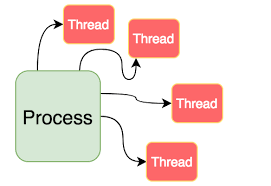
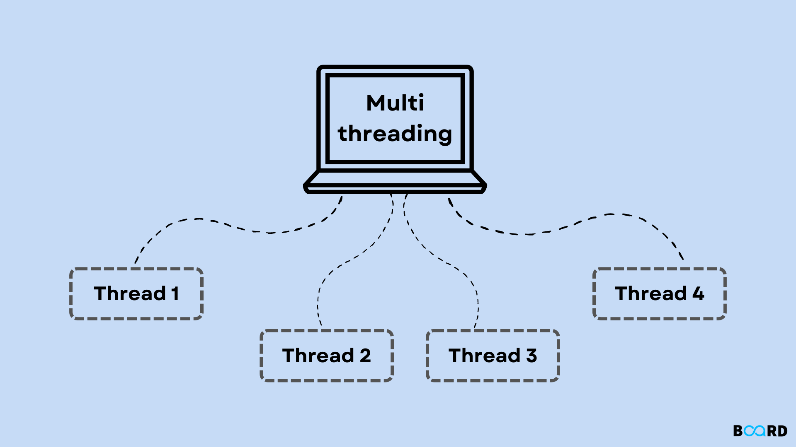
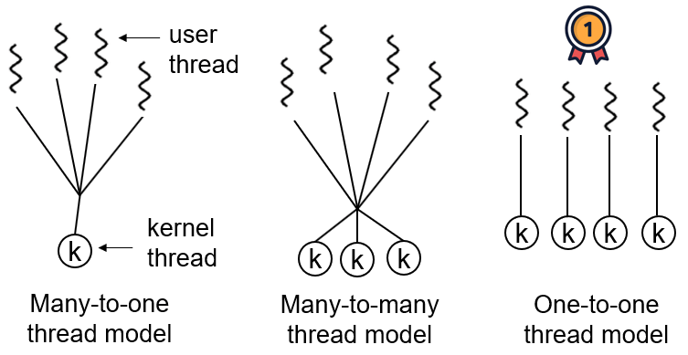
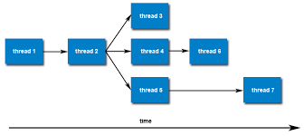
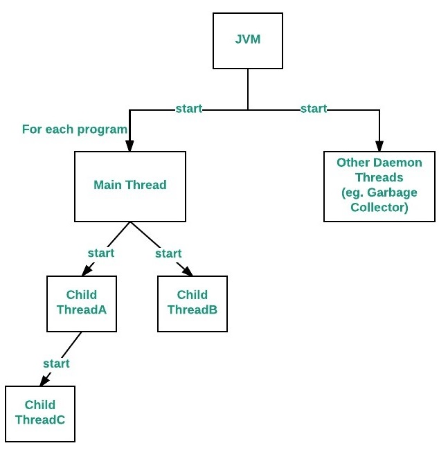

  <h1 style="text-align: center;font-weight: bold">Praktikum 10 Praktek Sistem Operasi</h1>
  <h4 style="text-align: center;">Dosen Pengampu : Dr. Ferry Astika Saputra, S.T., M.Sc.</h4>

 

  
  <h3 style="text-align: center;">Disusun Oleh : </h3>
  

    <strong>Fauzan Abderrasheed (3123500020) </strong> 
    <strong>Muhammad Rafi Dhiyaulhaq (3123500004) </strong> 
    <strong>Arva Zaki Fanadzan (3123500014)</strong>
  

<h3 style="text-align: center;line-height: 1.5">Politeknik Elektronika Negeri Surabaya Departemen Teknik Informatika Dan Komputer Program Studi Teknik Informatika 2023/2024</h3>
  

## THREADS

Thread adalah unit dasar dari pemanfaatan CPU dan merupakan komponen penting dalam sistem komputer multithreaded. Setiap thread dalam sebuah proses berbagi sumber daya yang sama seperti memori dan file, tetapi memiliki register dan stack sendiri.

#### Arsitektur MultiThread

Dalam arsitektur server multithread, server dapat menangani banyak permintaan klien secara bersamaan dengan membuat thread terpisah untuk setiap permintaan. Contohnya adalah web server yang menciptakan thread baru untuk setiap permintaan HTTP.

#### Keuntungan/benefit menggunakan multithreading

- Responsiveness: Dalam aplikasi dengan antarmuka pengguna, multithreading memungkinkan sebagian aplikasi tetap berjalan bahkan jika bagian lain terblokir.
- Resource Sharing: Thread dalam satu proses dapat dengan mudah berbagi sumber daya, seperti variabel global, yang membuat komunikasi antar thread lebih efisien dibandingkan antar proses.
- Economy: Membuat dan mengelola thread lebih murah daripada membuat dan mengelola proses karena thread dalam proses yang sama berbagi banyak sumber daya.
- Scalability: Thread memungkinkan aplikasi untuk memanfaatkan arsitektur multiprosesor atau multicore dengan lebih baik.

#### Multicore Programming

Multicore atau multiprosesor menambahkan tantangan baru seperti:

- Dividing Activities: Memecah tugas-tugas menjadi bagian-bagian yang dapat berjalan secara paralel.
Balance: Menjaga keseimbangan beban kerja di antara core-core.
- Data Splitting: Memisahkan data sehingga dapat diproses secara paralel.
- Data Dependency: Mengelola ketergantungan data antar thread.
- Testing and Debugging: Menguji dan debugging program yang berjalan secara paralel lebih kompleks.

Paralelisme memungkinkan suatu sistem untuk menjalankan banyak tugas secara bersamaan, sedangkan konkurensi memungkinkan banyak tugas untuk berjalan secara bersamaan, meskipun hanya ada satu prosesor.

#### Multithreading Models

- Many-to-One: Banyak thread pengguna dipetakan ke satu thread kernel. Model ini tidak mendukung paralelisme pada sistem multicore karena hanya satu thread yang dapat berjalan di kernel pada satu waktu.
- Many-to-Many: Banyak thread pengguna dipetakan ke banyak thread kernel. Model ini memungkinkan lebih fleksibel dan efisien dalam mengelola thread.
- One-to-One: Setiap thread pengguna dipetakan ke satu thread kernel. Model ini mendukung paralelisme tetapi bisa mahal karena setiap thread pengguna membutuhkan thread kernel.

#### Thread Library

- User-level Library: Dijalankan di ruang pengguna tanpa dukungan dari kernel.
- Kernel-level Library: Didukung langsung oleh kernel, sehingga memungkinkan thread pengguna untuk dipetakan ke thread kernel.

#### Pthreads

Adalah aturan baku untuk membuat dan mengelola thread pada sistem operasi UNIX seperti Solaris, Linux, dan Mac OS X. Thread adalah unit eksekusi mandiri dalam sebuah program, memungkinkan program untuk menjalankan beberapa tugas secara bersamaan.Implementasi Pthreads dapat dilakukan di level pengguna (user-level) atau di level kernel (kernel-level).

#### Windows Thread

menyediakan mekanisme untuk membuat dan mengelola thread. Setiap thread memiliki identitas unik (ID), kumpulan register, dan stack memori yang terpisah.

#### Java Thread

Dikelola oleh Java Virtual Machine (JVM) dan biasanya menggunakan model thread dari sistem operasi yang mendasarinya. Thread Java dapat dibuat dengan memperluas kelas Thread atau mengimplementasikan antarmuka Runnable.

#### Thread Implisit

Thread implisit merujuk pada teknik di mana pembuatan dan pengelolaan thread dilakukan oleh kompiler dan pustaka runtime, bukan oleh programmer. Teknik ini membantu mengurangi kompleksitas dalam penanganan thread secara eksplisit. Contoh metode ini termasuk:

- Thread Pools: Sekumpulan thread yang siap untuk menjalankan tugas. Thread pool mempercepat layanan permintaan karena menggunakan thread yang sudah ada daripada membuat thread baru.
- OpenMP: Kumpulan direktif kompiler dan API untuk pemrograman paralel di lingkungan memori bersama. OpenMP memungkinkan pembagian tugas dalam blok kode yang dapat dijalankan secara paralel.
- Grand Central Dispatch (GCD): Teknologi dari Apple untuk Mac OS X dan iOS yang memudahkan identifikasi dan pengelolaan bagian kode yang dapat dijalankan secara paralel.

#### Threading Issues

- Semantics of `fork()` and `exec()` system calls`: Dalam sistem UNIX, fork() dapat menggandakan thread yang memanggil atau seluruh thread. exec() menggantikan proses yang sedang berjalan termasuk semua thread.
- Signal Handling : Dalam sistem multi-threaded, sinyal dapat dikirim ke thread tertentu, semua thread, atau thread-thread tertentu saja.
- Thread cancellation of target thread: Melibatkan penghentian thread sebelum selesai. Ada dua pendekatan utama: pembatalan asinkron (segera) dan pembatalan tertunda (menunggu hingga thread mencapai titik pembatalan).
- Thread-local storage: Membolehkan setiap thread memiliki salinan data sendiri yang berguna ketika proses pembuatan thread tidak dikendalikan oleh programmer.
- Scheduler Activations: Model M:M dan two-level membutuhkan komunikasi antara thread pengguna dan kernel untuk menjaga jumlah thread kernel yang dialokasikan secara tepat. Ini sering menggunakan struktur data menengah yang dikenal sebagai lightweight process (LWP).