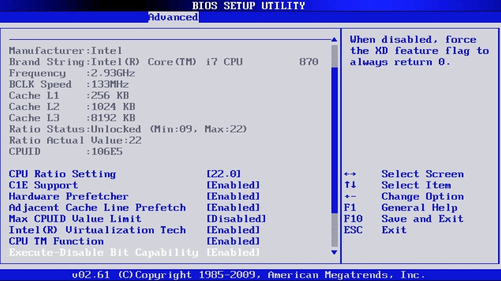
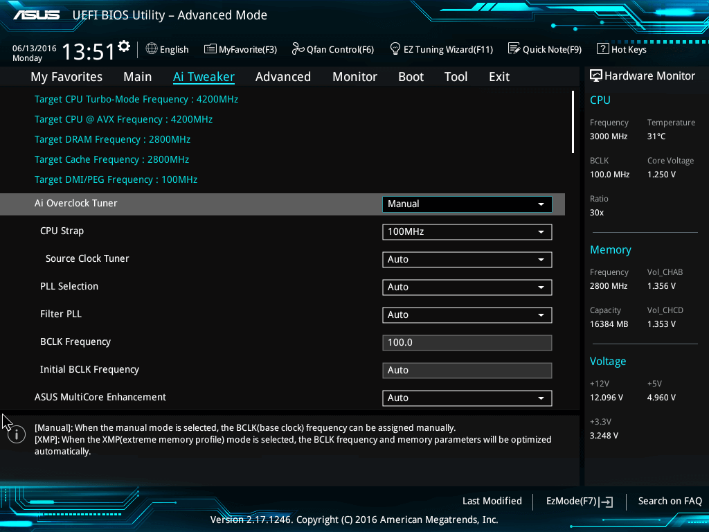
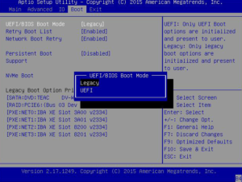
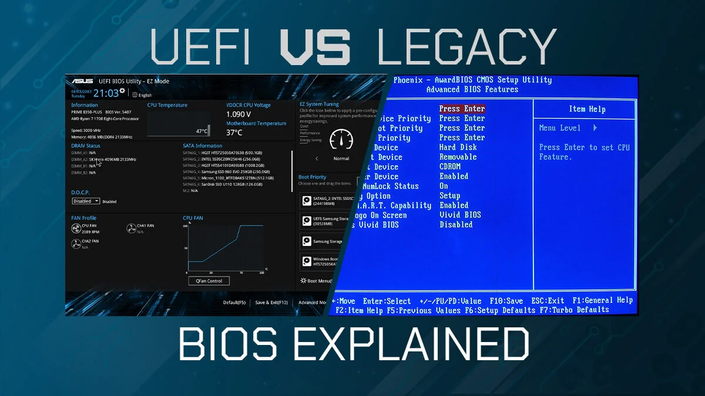

  <h1 style="text-align: center;font-weight: bold">Perbedaan Uefi dan Legacy Sistem Operasi</h1>
  <h4 style="text-align: center;">Dosen Pengampu : Dr. Ferry Astika Saputra, S.T., M.Sc.</h4>

 

  
  <h3 style="text-align: center;">Disusun Oleh : </h3>
  

    <strong>Fauzan Abderrasheed (3123500020) </strong> 
    <strong>Muhammad Rafi Dhiyaulhaq (3123500004) </strong> 
    <strong>Arva Zaki Fanadzan (3123500014)</strong>
  

<h3 style="text-align: center;line-height: 1.5">Politeknik Elektronika Negeri Surabaya Departemen Teknik Informatika Dan Komputer Program Studi Teknik Informatika 2023/2024</h3>
  

## Daftar Isi
1. [Pendahuluan](#apa-itu-bios)
2. [Soal](#soal)
3. [Referensi](#referensi)
## apa itu BIOS?

<strong>BIOS </strong>merupakan singkatan dari Basic Input Output System. merupakan suatu software (ditulis dalam bahasa assembly) yang mengatur fungsi dasar dari perangkat keras (hardware) komputer. BIOS tertanam dalam sebuah chip memory (ROM ataupun Flash Memory) berbahan Comlpimentari Metal Oxide Semiconductor (CMOS) yang terdapat pada motherboard. Sebuah baterai yang biasa disebut sebagai baterai CMOS berfungsi untuk menjaga agar tanggal dan settingan lainnya yang telah kita set pada BIOS tidak hilang atau kembali ke konfigurasi awal meskipun komputer dimatikan.
## apa itu UEFI?

<strong>UEFI</strong> adalah Unified Extensible Firmware Interface, UEFI merupakan teknologi terbaru yang dibuat untuk penyempurnaan dari BIOS yang lama menjadi BIOS yang memiliki fungsi lebih optimal.
Lantas kapan UEFI ada? kehadiran nya bermula saat ada standard EFI pada komputer sekitar tahun 1990 an, saat itulah UEFI muncul. pada tahun tersebut perusahaan yang sudah memakai standar EFI yaitu Intel dan Hp.
Setelah sekian tahun dan dengan kemajuan teknologi, sistem EFI mulai berkembang supaya dapat dioperasikan di semua perangkat komputer. dari situlah muncul sistem baru yang bernama UEFI atau EFI V2.X ini, namun banyak orang yang mengenal nya dengan sebutan UEFI.
Untuk saat ini sistem UEFI sudah banyak dioperasikan di semua komputer maupun laptop generasi terbaru, karena saat ini perkembangan hardware komputer sudah canggih, BIOS sendiri sudah hampir tidak mampu memberikan support, terutama pada pengguna hardisk dengan kapasitas 2 terabyte.
Jadi fungsi UEFI adalah untuk menggantikan dari kinerja BIOS yang sudah mengalami ketertinggalan zaman
## apa itu LEGACY?

<strong>LEGACY </strong>adalah alat yang membantu firmware Bios dalam memproses boot, dimana fungsi dari legacy yaitu untuk menyimpan daftar perangkat penyimpanan yang bisa untuk di boot seperti floopy disk drives, optical disk drive dan hard disk drive,
Saat kamu menyalakan komputer, secara tidak langsung BIOS akan beroperasi dan melakukan Power On Self-Test (POST) yang ditandai dengan bunyi bip dari sistem internal, dimana suara tersebut menandakan booting berjalan dengan normal

Sesudah melakukan proses POST,  firmware tersebut akan mengambil sektor pertama dari setiap perangkat penyimpanan yang sudah dijadikan target dan menyimpannya ke dalam memori,
Di samping itu, firmware akan melakukan pemindaian terhadap MBR (Master Boot Record) yang sudah tervalidasi. Setelah menemukan MBR yang sah, firmware akan melanjutkan untuk  mengeksekusi ke bootloader untuk memilih partisi tempat booting.

Ketika dalam proses booting terdapat bagian yang tidak sesuai atau tidak valid, maka firmware akan meneruskan ke perangkat selanjutnya sesuai dengan urutan prioritas.

### SOAL

## Apa perbedaan UEFY DAN LEGACY?

1. Struktur dan Antarmuka

UEFI memiliki antarmuka yang lebih modern dan grafis dibandingkan dengan Legacy BIOS yang berbasis teks. Hal ini memudahkan pengguna dalam mengatur pengaturan firmware dan memantau berbagai informasi tentang perangkat keras. 📊

2. Kapasitas dan Skalabilitas

UEFI mendukung partisi boot berkapasitas lebih besar dibandingkan dengan Legacy BIOS. UEFI juga didesain dengan kemampuan skala yang lebih baik, sehingga dapat mendukung sistem operasi dan perangkat keras yang lebih modern dan kompleks. 📈

3. Kecepatan Booting

UEFI mampu melakukan proses booting secara lebih cepat dibandingkan dengan Legacy BIOS. Hal ini karena UEFI dapat melakukan inisialisasi perangkat keras secara paralel, sedangkan Legacy BIOS melakukan inisialisasi secara serial. ⏱

4. Keamanan

UEFI memberikan fitur keamanan yang lebih baik dibandingkan dengan Legacy BIOS. UEFI memiliki mekanisme verifikasi digital yang memastikan integritas firmware dan membantu mencegah serangan malware yang merusak atau menggantikan firmware. 🔒

5. Kompatibilitas

Legacy BIOS memiliki tingkat kompatibilitas yang lebih tinggi dengan perangkat keras dan sistem operasi yang sudah ada sejak lama. UEFI, meskipun mendukung mode kompatibilitas dengan Legacy BIOS, tidak dapat berfungsi secara optimal jika digunakan dengan perangkat keras atau sistem operasi yang didesain khusus untuk mode UEFI. 🚀

6. Konfigurasi

UEFI menyediakan antarmuka pengaturan yang lebih lengkap dan mudah digunakan daripada Legacy BIOS. Pengguna dapat mengatur berbagai opsi terkait booting, hardware, dan keamanan dengan lebih fleksibel melalui antarmuka grafis yang intuitif. ⚙

7. Perkembangan dan Dukungan

UEFI merupakan standar industri yang aktif berkembang dan mendapatkan dukungan penuh dari para produsen perangkat keras dan perangkat lunak. Legacy BIOS, meskipun masih digunakan secara luas, sudah tidak lagi mendapatkan pembaruan rutin dan dukungan dari banyak produsen

### proses UEFI dan LEGACY

### Perbedaan Proses 

terdapat beberapa perbedaan utama antara proses booting pada UEFI (Unified Extensible Firmware Interface) dan Legacy BIOS (Basic Input/Output System). Berikut adalah kesimpulan perbedaannya:

1. *Inisialisasi Firmware*: Pada UEFI, inisialisasi firmware UEFI terjadi setelah POST, sementara pada Legacy BIOS, inisialisasi BIOS terjadi langsung setelah POST.

2. *Boot Manager*: UEFI menggunakan UEFI Boot Manager yang dapat memuat beberapa file konfigurasi untuk memilih perangkat booting, sedangkan Legacy BIOS langsung mencari Master Boot Record (MBR) di perangkat booting.

3. *Partisi dan Keamanan*: UEFI mendukung booting dari partisi GPT yang lebih besar dan memiliki fitur keamanan seperti Secure Boot, sementara Legacy BIOS memiliki keterbatasan dalam ukuran partisi booting dan tidak memiliki fitur keamanan seperti Secure Boot.

4. *MBR vs. GPT*: Legacy BIOS menggunakan MBR (Master Boot Record) untuk menentukan partisi booting, sementara UEFI menggunakan GPT (GUID Partition Table), yang memiliki keuntungan dalam ukuran partisi dan jumlah partisi yang dapat didukung.

5. *PXE Boot*: UEFI mendukung booting jaringan (PXE boot), yang memungkinkan booting melalui jaringan lokal, sedangkan Legacy BIOS tidak secara native mendukung fitur ini.

Dengan demikian, kesimpulan dari perbedaan antara UEFI dan Legacy BIOS dalam proses booting adalah bahwa UEFI memberikan lebih banyak fleksibilitas, dukungan untuk partisi yang lebih besar, fitur keamanan yang lebih baik, dan kemampuan untuk booting jaringan, sementara Legacy BIOS memiliki keterbatasan dalam hal partisi dan keamanan.

## Referensi
<ul>
<li><a href = "https://seberkas.com/perbedaan-uefi-dan-legacy/">Apa itu UEFI?</a?></li>
<li><a href = "https://seberkas.com/perbedaan-uefi-dan-legacy/">Apa itu LEGACY?</a?></li>
<li><a href = "https://www.perbedaan.co.id/perbedaan-uefi-dan-legacy/#Pendahuluan">Perbedaan UEFI dan LEGACY?</a?></li>
</ul>