

  <h1 style="text-align: center;font-weight: bold"> Sistem Operasi</h1>
  <h4 style="text-align: center;">Dosen Pengampu : Dr. Ferry Astika Saputra, S.T., M.Sc.</h4>

 

  
  <h3 style="text-align: center;">Disusun Oleh : </h3>
  

    <strong>Fauzan Abderrasheed (3123500020) </strong> 
    <strong>Muhammad Rafi Dhiyaulhaq (3123500004) </strong> 
    <strong>Arva Zaki Fanadzan (3123500014)</strong>
  

<h3 style="text-align: center;line-height: 1.5">Politeknik Elektronika Negeri Surabaya Departemen Teknik Informatika Dan Komputer Program Studi Teknik Informatika 2023/2024</h3>
  

  

  ## Daftar Isi
1. [Soal](#soal)
2. [Perbandingan](#perbandingan)
3. [Analisa](#analisa)
3. [Kesimpulan](#kesimpulan)
### Soal
Jalankan VM Debian anda, lalu lakukan clone https://github.com/ferryastika/flops-iops. Compile dan eksekusi sesuai petunjuk. Sesuiakan jumlah thread dengan jumlah CPU yang ada di VM Debianmu. Catat hasilnya dan jelaskan arti dari hasil ekskusi. Lakukan sebanyak 5 kali. Bandingkan hasilnya antar temanmu. Buat Plot perbandinnga hasil untuk masing-masing PC di tiap kelompokmu. Analisa hasil percobaan tadi dan beri kesimpulan tentang IOPS dan FLOPS.

##### Hasil Running program FLOPS
- Hasil pertama

Running dari program Arva Zaki
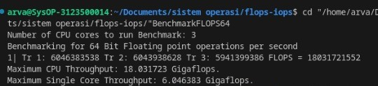

Running dari program Fauzan Abderrasheed
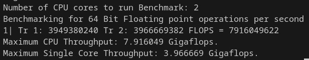

Running dari program Muhammad Rafi Dhiyaulhaq
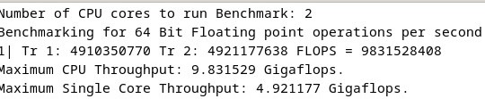

- Hasil kedua
Running dari program Arva Zaki
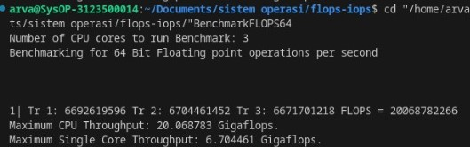
Running dari program Fauzan Abderrasheed
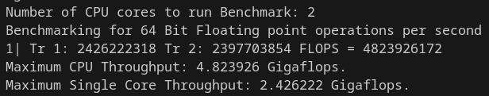
Running dari program Muhammad Rafi Dhiyaulhaq
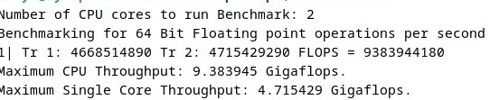

- Hasil ketiga
Running dari program Arva Zaki
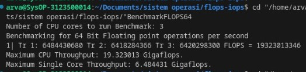
Running dari program Fauzan Abderrasheed

Running dari program Muhammad Rafi Dhiyaulhaq
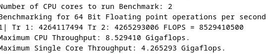

- Hasil keempat
Running dari program Arva Zaki
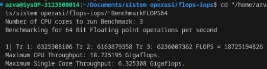
Running dari program Fauzan Abderrasheed
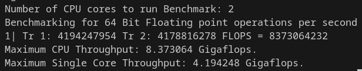
Running dari program Muhammad Rafi Dhiyaulhaq
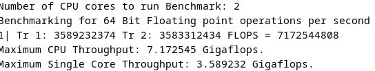

- Hasil kelima
Running dari program Arva Zaki
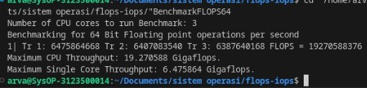
Running dari program Fauzan Abderrasheed
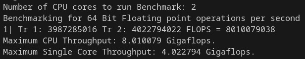
Running dari program Muhammad Rafi Dhiyaulhaq
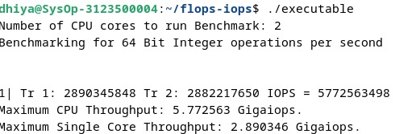

##### Hasil Running program IOPS
- Hasil pertama
Running dari program Arva Zaki
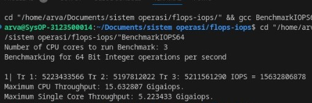
Running dari program Fauzan Abderrasheed

Running dari program Muhammad Rafi Dhiyaulhaq
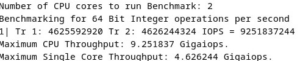
- Hasil kedua
Running dari program Arva Zaki
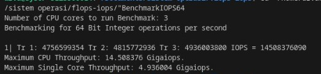
Running dari program Fauzan Abderrasheed
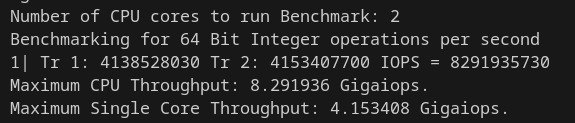
Running dari program Muhammad Rafi Dhiyaulhaq
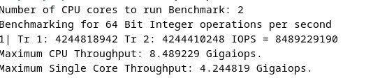
- Hasil ketiga
Running dari program Arva Zaki
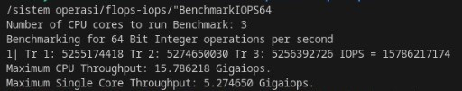
Running dari program Fauzan Abderrasheed
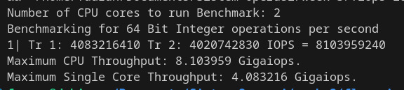
Running dari program Muhammad Rafi Dhiyaulhaq
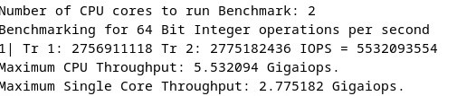
- Hasil keempat
Running dari program Arva Zaki
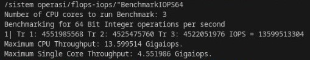
Running dari program Fauzan Abderrasheed
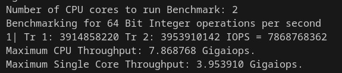
Running dari program Muhammad Rafi Dhiyaulhaq
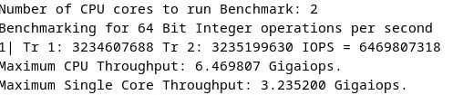
- Hasil kelima
Running dari program Arva Zaki
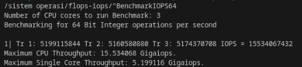
Running dari program Fauzan Abderrasheed
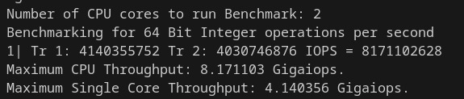
Running dari program Muhammad Rafi Dhiyaulhaq

### Perbandingan
<table>
<thead>
<tr>
  <th style="background-color: blue; color: white">Nama</th>
  <th style="background-color: blue; color: white">Jumlah CPU Core</th>
  <th style="background-color: blue; color: white">Max FLOPS (CPU Throughput)</th>
  <th style="background-color: blue; color: white">Max FLOPS (Single Core Throughput)</th>
  <th style="background-color: blue; color: white">Max IOPS (CPU Throughput)</th>
  <th style="background-color: blue; color: white">Max IOPS (Single Core Throughput)</th>
<tr>
</thead>
<tbody>
  <tr>
  <td>Fauzan Abderrasheed</td>
  <td>2</td>
  <td>8.373064</td>
  <td>4.194248</td>
  <td>8.291936</td>
  <td>4.153408</td>
  </tr>
   <tr>
  <td>Arva Zaki Fanadzan</td>
  <td>3</td>
  <td>20.068783</td>
  <td>6.704461</td>
  <td>15.786218</td>
  <td>5.274650</td>
  </tr>
   <tr>
  <td>Muhammad Rafi Dhiyaulhaq</td>
  <td>2</td>
  <td>9.831529</td>
  <td>4.921177</td>
  <td>9.251837</td>
  <td>4.626244</td>
  </tr>
</tbody>
</table>

#### Analisa
program yang dijalankan merupakan program benchmark untuk mengukur FLOPS (Floating-point Operations Per Second) dan IOPS (Input Output Operations per Second) pada CPU. Program dijalankan lima kali, masing-masing dengan jumlah inti CPU yang berbeda: 3, 2, dan 2. Hasilnya menunjukkan bahwa CPU memiliki peringkat FLOPS yang lebih tinggi ketika lebih banyak inti yang digunakan.
Secara keseluruhan, program benchmark menunjukkan bahwa peringkat FLOPS IOPS CPU meningkat seiring dengan meningkatnya jumlah inti CPU yang digunakan. Hal ini karena program ini mampu mendistribusikan beban kerja ke beberapa inti, sehingga memungkinkannya melakukan lebih banyak operasi secara bersamaan.

#### Kesimpulan
FLOPS mengukur jumlah operasi floating-point yang dapat dilakukan oleh unit pemrosesan pusat (CPU) dalam satu detik. Operasi floating-point adalah perhitungan yang melibatkan angka dengan titik desimal.
IOPS mengukur jumlah operasi bilangan bulat yang dapat dilakukan CPU dalam satu detik. Operasi bilangan bulat adalah perhitungan yang melibatkan bilangan bulat.
Kesimpulannya, FLOPS dan IOPS merupakan metrik penting untuk mengukur kinerja CPU. FLOPS penting untuk tugas-tugas yang melibatkan banyak perhitungan floating-point. IOPS penting untuk tugas-tugas yang melibatkan banyak operasi integer.