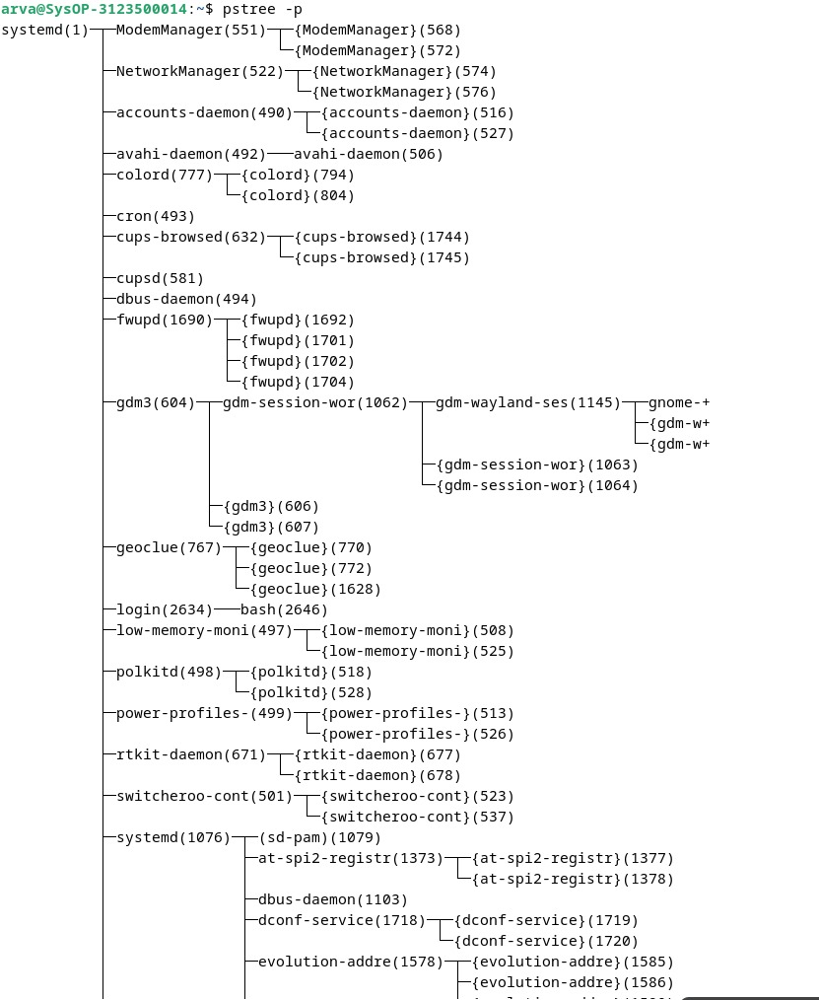
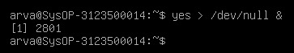

  <h1 style="text-align: center;font-weight: bold"> Sistem Operasi</h1>
  <h4 style="text-align: center;">Dosen Pengampu : Dr. Ferry Astika Saputra, S.T., M.Sc.</h4>

 

  
  <h3 style="text-align: center;">Disusun Oleh : </h3>
  

    <strong>Fauzan Abderrasheed (3123500020) </strong> 
    <strong>Muhammad Rafi Dhiyaulhaq (3123500004) </strong> 
    <strong>Arva Zaki Fanadzan (3123500014)</strong>
  

<h3 style="text-align: center;line-height: 1.5">Politeknik Elektronika Negeri Surabaya Departemen Teknik Informatika Dan Komputer Program Studi Teknik Informatika 2023/2024</h3>
  

## Daftar Isi
1. [Dasar Teori](#dasar-teori)
2. [Tugas Pendahuluan](#tugas-pendahuluan)
3. [Percobaan](#percobaan)

### Dasar Teori
- KONSEP PROSES PADA SISTEM OPERASI LINUX
Proses adalah program yang sedang dieksekusi. Setiap kali menggunakan utilitas sistem atau program aplikasi dari shell, satu atau lebih proses ”child” akan dibuat oleh shell sesuai perintah yang diberikan. Setiap kali instruksi dibe rikan pada Linux shell, maka kernel akan menciptakan sebuah proses-id. Proses ini disebut juga dengan terminology Unix sebagai sebuah Job.   Proses Id (PID) dimulai dari 0, yaitu proses INIT, kemudian diikuti oleh proses berikutnya (terdaftar pada /etc/inittab).
Beberapa tipe proses :
- Foreground Proses yang diciptakan oleh pemakai langsung pada terminal (interaktif, dialog)
- Batch
Proses yang dikumpulkan dan dijalankan secara sekuensial (satu persatu).   Prose Batch tidak diasosiasikan (berinteraksi) dengan terminal.
- Daemon proses yang menunggu permintaan (request) dari proses lainnya dan menjalankan tugas sesuai dengan permintaan tersebut. Bila tidak ada request, maka program ini akan berada dalam kondisi “idle” dan tidak menggunakan waktu hitung CPU. Umumnya nama proses daemon di UNIX berakhiran d, misalnya inetd, named, popd dll
 
- SINYAL
Proses dapat mengirim dan menerima sinyal dari dan ke proses lainnya. Proses mengirim sinyal melalui instruksi “kill” dengan format
kill [-nomor sinyal] PID
Nomor sinyal : 1 s/d maksimum nomor sinyal yang didefinisikan system Standar nomor sinyal yang terpenting adalah :

- MENGIRIM SINYAL
Mengirim sinyal adalah satu alat komunikasi antar proses, yaitu memberitahukan proses yang sedang berjalan bahwa ada sesuatu yang harus dikendalikan. Berdasarkan sinyal yang dikirim ini maka proses dapat bereaksi dan administrator/programmer   dapat   menentukan   reaksi   tersebut.	Mengirim sinyal menggunakan instruksi
kill [-nomor sinyal] PID
Sebelum mengirim sinyal PID proses yang akan dikirim harus diketahui terlebih dahulu.

- MENGONTROL PROSES PADA SHELL
Shell menyediakan fasilitas job control yang memungkinkan mengontrol beberapa job atau proses yang sedang berjalan pada waktu yang sama. Misalnya bila melakukan pengeditan file teks dan ingin melakukan interrupt pengeditan untuk mengerjakan hal lainnya. Bila selesai, dapat kembali (switch) ke editor dan melakukan pengeditan file teks kembali.
Job bekerja pada foreground atau background. Pada foreground hanya diper untukkan untuk satu job pada satu waktu. Job pada foreground akan mengontrol shell - menerima input dari keyboard dan mengirim output ke layar. Job pada background tidak menerima input dari terminal, biasanya berjalan tanpa memerlukan interaksi.
Job pada foreground kemungkinan dihentikan sementara (suspend), dengan menekan [Ctrl-Z]. Job yang dihentikan sementara dapat dijalankan kembali pada foreground atau background sesuai keperluan dengan menekan ”fg” atau ”bg ”. Sebagai catatan, menghentikan job seme ntara sangat berbeda dengan melakuakan interrupt job (biasanya menggunakan [Ctrl-C]), dimana job yang diinterrup akan dimatikan secara permanen dan tidak dapat dijalankan lagi.

- MENGONTROL PROSES LAIN
Perintah ps dapat digunakan untuk menunjukkan semua proses yang sedang berjalan pada mesin (bukan hanya proses pada shell saat ini) dengan format :
ps –fae atau
ps -aux
Beberapa versi UNIX mempunyai utilitas sistem yang disebut top yang menyediakan cara interaktif untuk memonitor aktifitas sistem. Statistik secara detail dengan proses yang berjalan ditampilkan dan secara terus-menerus di-refresh . Proses ditampilkan secara terurut dari utilitas CPU. Kunci yang berguna pada top adalah
s – set update frequency
u – display proses dari satu user
k – kill proses (dengan PID)
q – quit
Utilitas untuk melakukan pengontrolan proses dapat ditemukan pada sistem UNIX adalah perintah killall. Perintah ini akan menghentikan proses sesuai PID atau job number proses.

### Tugas pendahuluan
   1. Apa yang dimaksud dengan proses ?
   2. Apa yang dimaksud perintah untuk menampilkan status proses : ps,pstree
   3. Sebutkan opsi yang dapat diberikan pada perintah ps
   4. Apa yang dimaksud dengan sinyal?Apa perintah untuk mengirim sinyal?
   5. Apa yang dimaksud dengan proses foreground dan background pada job control
   6. Apa yang dimaksud perintah - perintah penjadwalan prioritas :
   Top,Nice ,Renice 

#### Jawaban
1. Apa yang dimaksud dengan proses ?

 Proses adalah program yang sedang berjalan atau sebuah kinerja yang dijalankan dalam komputer yang sedang dieksekusi, dimana setiap kali kita membuat atau menjalankan sebuah proses maka akan dibuatkan sebuah tanda terhadap proses yang kita jalankan tersebut, tanda yang dijalankan dapat berupa nomor id, nama dari proses itu sendiri, jumlah kapasitas penyimpanan yang digunakan dan waktu yang digunakan untuk mengaksesnya.

 2. Apa yang dimaksud perintah untuk menampilkan status proses : ps,pstree

    -  Ps adalah Perintah yang dapat digunakan untuk menunjukkan semua proses yangsedang berjalan pada mesin (bukan hanya proses pada shell saat ini). Instruksi ps (processstatus) digunakan untuk melihat kondisi proses yang ada. 

    - Pstree Sama halnya dengan perintah ps. Pstree juga mempunyai fungsi yang sama untuk melihat status proses yang berjalan pada sistem. Tetapi informasinya di perlihat dengan bentuk tree (pohon)

3. Sebutkan opsi yang dapat diberikan pada perintah ps

-  $ps untuk melihat kondisi proses yang ada

-  $ps -u untuk melihat faktor/element lainnya

-  $ps -u <user> mencari proses yang spesifik pemakai

 -  $ps -a mencari proses lainnya (all)

-  $ps -au mencari proses lainnya (all user)

-  $ps -eH untuk semua proses, H untuk hirarki tampilan proses

-  $ps -e f menampilkan status proses dengan karakter grafis

4. Apa yang dimaksud dengan sinyal?Apa perintah untuk mengirim sinyal?

Sinyal adalah cara yang digunakan oleh sistem operasi untuk mengirim pesan ke proses. Sinyal ini bisa digunakan untuk berbagai hal, seperti memberhentikan proses, memberi tahu proses untuk memuat kembali konfigurasi, dan lain-lain.
Proses mengirim sinyal untuk memberhentikan proses melalui instruksi “kill” dengan format
kill [-nomor sinyal] PID

5. Apa yang dimaksud dengan proses foreground dan background pada job control

Job bekerja pada foreground atau background. Pada foreground hanya diperuntukkan untuk satu job pada satu waktu. Job pada foreground akan mengontrol shell - menerima input dari keyboard dan mengirim output ke layar. Job pada background tidak menerima input dari terminal, biasanya berjalan tanpa memerlukan interaksi.
Job pada foreground kemungkinan dihentikan sementara (suspend), dengan menekan [Ctrl-Z]. Job yang dihentikan sementara dapat dijalankan kembali pada foreground atau background sesuai keperluan dengan menekan ”fg” atau ”bg ”. Sebagai catatan, menghentikan job seme ntara sangat berbeda dengan melakuakan interrupt job (biasanya menggunakan [Ctrl-C]), dimana job yang diinterrup akan dimatikan secarapermanen dan tidak dapat dijalankan lagi.

6. Apa yang dimaksud perintah - perintah penjadwalan prioritas :
   Top,Nice ,Renice

- Top : Memonitor aktifitas system.

- Nice : mengubah prioritas pada proses.

-  Renice : mengurangi prioritas pada proses.

### Percobaan

1. Login sebagai user dan menginstall program C++

Analisa : menginstall compiler g++ dan membuat code untuk mengecek bilangan prima dengan bahasa c++ lalu di compile menggunakan perintah g++ (namafile) lalu hasil compile dibuka maka akan muncul outputnya.

### Percobaan 1

1. Pindah ke command line terminal (tty2) dengan menekan Ctrl+Alt+F2 dan login sebagai user

2. Instruksi ps digunakan untuk melihat kondisi yang ada. PID adalah nomor identitas proses, TTY adalah nama terminal dimana proses tersebut aktif, STATA berisi S(sleeping) dan R (running), COMMAND merupakan instruksi yang digunakan $ps

Analisa : Ps digunakan untuk melihat proses yang ada

3. Untuk melihat faktor atau elemen lainnya,gunakan option -u(user).%CPU adalah presentasi cpu time yang digunakan oleh proses tersebut %MEM adalah presentasi system memori yang digunakan proses,SIZE adalah jumlah memori yang digunakan , RSS adalah Real System Storage atau jumlah memori yang digunakan ,START adalah kapan proses tersebut diaktifkan   $ps -u

Analisa : Ps -u digunakan untuk menampilkan user yang kita gunakan

4. Mencari proses yang spesifik pemakai, proses diatas hanya terbatas pada proses milik pemakai, dimana pemakai tersebut melakukan login   menggunakan perintah $ps -u user

Analisa : perintah tersebut digunakan untuk menampilkan proses pada user yang kita inginkan

5. Mencari proses lainnya gunakan opsi (all) dan au (all user) menggunakan perintah $ps -a $ps -au

Analisa : Digunakan untuk menampilkan proses pada user sekarang, dan juga semua user.

### Percobaan 2

1. Pindah ke command line terminal (tty2) dengan menekan Ctrl+Alt+F2 dan login sebagai user

2. ketik ps -eH dan tekan enter. opsi e memilih semua proses dan opsi H menghasilkan tampilan proses secara hirearki. proses child muncul dibawah proses parent. proses child ditandai dengan awalan ebeberapa spasi $ps -eH

Analisa : perintah $ pstree yang kemudian ditambahkan opsi
 – h berfungsi Untuk menampilkan proses dengan cara ditampilkan 

3. ketik ps -e f dan tekan enter. tampilan serupa dengan langkah 2 opsi f akan menampilkan status proses dengan karakter grafis (\dan_) $ps -e f

Analisa : pada perintah ini ditambahkan opsi f yang berfungsi untuk mengetahui STAT (keadaan) darisebuah proses itu yang biyasanya ditandai dengan simbol S (sleeping) atau R (Running)

4. ketik pstree dan tekan enter akan ditampilkan semua proses pada sistem dalam bentuk hirearki parent/child. proses parent disebelah kiri proses child. sebagai contoh init sebagai parent dari semua proses pada sistem. beberapa child dari init mempunyai child. proses login mempunyai proses bash sebagai child. proses bash mempunyai proses child startx. proses startx mempunyai child xinit dan seterusnya, $pstree

Analisa : system ditampilkan dalam bentuk hirarki parent/child. Proses parent disebelah kiri proses child.Sebagai contoh proses init sebagai parent dari semua proses pada sistem. Beberapa child dari init mempunyai child. Proses bash mempunyai proses child startx. Proses startx  mempunyai child xinit dan seterusnya hingga membentuk seperti pohon

5. ketik pstree | grep mingetty dan tekan enter. akan menampilkan semua proses mingetty yang berjalan pada system yang berupa console virtual.selain menampilkan semua proses ,proses dikelompokan dalam satu baris dengan suatu angka sebagai jumlah proses yang berjalan.
$pstree | grep mingetty.

6. untuk melihat semua PID untuk proses gunakan opsi -p
$ pstree -p

Analisa : pada proses ini hanya ditambahkan dengan imformasi mengenai PID dari proses yang digunakan dengan menambahkan Opsi– p

7. untuk menampilkan proses dan ancestor yang tercetak tebal gunakan opsi -h $pstree -h

Analisa : perintah $ pstree yang kemudian ditambahkan opsi
 – h berfungsi Untuk menampilkan proses dan ancestor dengan cara ditampilkan atau dicetak tebal

### Percobaan 3

1. Pindah ke command line terminal (tty2) dengan menekan Ctrl+Alt+F2 dan login sebagai user

2. ketik ps -e | more dan tekan enter. opsi -e menampilkan semua proses dalam bentuk 4 kolom: PID,TTY,TIME dan CMD.
$ps -e | more, jika halaman penuh terlihat prompt --more-- dibagian bawah screen,tekan q untuk kembali ke prompt perintah.

Analisa : menampilkan semua proses dalam bentuk 4 kolom: PID,TTY,TIME dan CMD. dan jika merasa kurang dapat menekan enter untuk more atau melihat proses lebih banyak.

3. ketik ps ax | more dan tekan enter, opsi a akan menampilkan semua proses yang dihasilkan terminal tty. opsi x menampilkan semua proses yang tidak dihasilkan terminal. secara logika opsi ini sama dengan opsi -e . terdapat 5 kolom: PID,TTY,STAT,TIME dan COMMAND. $ps ax | more.

Analisa : opsi a akan menampilkan semua proses yang dihasilkan terminal tty. opsi x menampilkan semua proses yang tidak dihasilkan terminal

4. ketik ps -ef | more dan tekan enter. opsi -ef akan menampilkan semua proses dalam format penuh $ps -ef | more.
jika halaman penuh terlihat prompt --more-- dibagian bawah screen tekan q untuk kembali ke prompt perintah.

Analisa : opsi -ef akan menampilkan semua proses dalam format penuh

5. ketik ps -eo pid,cmd|more dan tekan enter. opsi -eo akan menampilkan semua proses dalam format sesuai definisi user yaitu terdiri dari kolom pid,dan cmd
$ps -eo pid,cmd | more, jika halaman penuh terlihat prompt --more-- dibagian bawah screen tekan q untuk kembali ke prompt perintah.

Analisa : prosesnya akandiawali dengan membacaan perintah $ ps yang kemudian dilanjutkan dengan membacaOpsi – eo pid, cmd yang berfungsi untuk menampilkan semua proses dalam format sesuaidefinisi user yang terdiri dari kolom PID dan CMD

6. ketik ps -eo pid,ppid,%mem,cmd|more dan tekan enter.Akan menampilkan kolom PID,PPID, dan %MEM. PPID adalah proses ID dari proses parent. %MEM menampilkan presentasi memori sistem yang digunakan proses jika proses menggunakan sedikit memori akan ditampilkan 0.
$ps -eo pid,ppid,%mem,cmd|more.

Analisis : prosesnya akan diawali dengan membacaan perintah $ ps yang kemudian dilanjutkandengan membaca opsi – eo pid,ppid,%mem,cmd yang berfungsi untuk menampilkankolom PID, PPID dan %MEM. Dimana PPID adalah proses ID dari proses parentsedangkan %MEM menampilkan persentasi memory system yang digunakan proses

### Percobaan 4

1. Pindah ke command line terminal (tty2) dengan menekan Ctrl+Alt+F2 dan login sebagai user

2. Gunakan perintah yes yang mengirim output y yang tidak pernah berhenti $yes, untuk menghentikannya tekan Ctrl+C.

Analisa : perintah yes ini digunakan untuk mengirim output y yang tidak pernah berhenti.

3. Belokan standart output ke /dev/null  
$yes > /dev/null, untuk menghentikkanya tekan Ctrl+C.

Analisa :Perintah ini digunakan membelokan standart output dari perintah yes ke /dev/null

4. Salah satu cara agar perintah yes tetap dijalankan tetapi shell tetap digunakan untuk hal yang lain dengan meletakkan proses pada background dengan menambahkan karakter & pada akhir perintah.
$yes > /dev/null & ,angka dalam "[]" merupakan job number diikuti PID.

Analisa : perintah yes tetap dijalankan tetapi shell lain tetap digunakan untuk hal laindengan meletakkan proses pada background dengan menambah karakter & pada akhir  perintah[1] merupakan job number pid

5. untuk melihat proses gunakan perintah $jobs.

Analisa : melihat proses yang sedang running menggunakan perintah jobs

6. Untuk menghentikan job,gunakan perintah kill diikuti job number atau PID proses. untuk identifikasi job number,diikuti prefix dengan karakter "%".

$kill %nomorjob,
contoh : kill %1

7. Lihat status job setelah diterminasi

Analisa : perintah diatas digunakan untuk menghentikan job dan mengetikan perintah jobs untuk melihat proses yang telah diterminasi

