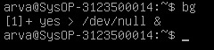
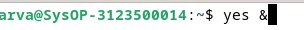

<div align="center">
  <h1 style="text-align: center;font-weight: bold">praktikum 6<br>Sistem Operasi</h1>
  <h4 style="text-align: center;">Dosen Pengampu : Dr. Ferry Astika Saputra, S.T., M.Sc.</h4>
</div>
<br />
<div align="center">
  
  <h3 style="text-align: center;">Disusun Oleh : </h3>
  <p style="text-align: center;">
    <strong>Fauzan Abderrasheed (3123500020) </strong><br>
    <strong>Muhammad Rafi Dhiyaulhaq (3123500004) </strong><br>
    <strong>Arva Zaki Fanadzan (3123500014)</strong>
  </p>
<h3 style="text-align: center;line-height: 1.5">Politeknik Elektronika Negeri Surabaya<br>Departemen Teknik Informatika Dan Komputer<br>Program Studi Teknik Informatika<br>2023/2024</h3>
  <hr><hr>
</div>

### Percobaan 5

1. Cara lain meletakkan job pada background dengan job secara normal (pada foreground),stop dan memulai lagi pada background 
```
$ yes > /dev/null
```
Hentikan sementara job (suspend),bukan menghentikannya (terminate),tetapi menghentikan sementara job sampai di restart. untuk menghentikan sementara menggunakan Ctrl+Z.


2. untuk restart job pada foregorund, gunakan perintah fg
```
$ fg
```


3. Shell akan menampilkan nama perintah yang diletakkan pada foreground,stop job lagi dengan Ctrl+Z. Kemudian gunakan perintah bg untuk meletakkan job pada backgroud
```
$ bg
```
Job ini tidak bisa dihentikan menggunakan Ctrl+Z,karena job berada pada background. untuk menghentikannya,letakkan job pada foregorund dengan fg dan kemudian Ctrl+Z



4. Job pada background dapat digunakan untuk menampilkan teks pada terminal, dimana dapat diabaikan jika mencoba mengerjakan job lain.
```
$ yes &
```
untuk menghentikannya tidak dapat menggunakan Ctrl+Z. job harus dipindah ke foreground,baru dihentikan dengan cara tekan fg dan enter, kemudian dilanjutkan dengan Ctrl+Z untuk menghentikkan sementara




5. Apabila ingin menampilkan banyak job dalam satu waktu,letakkan job pada foreground atau background dengan memberikan job id
```
$ fg %2 atau $ %2
$ bg %2
```


6. tekan fg dan enter kemudian dilanjutkan dengan ctrl+z untuk menghentikan sementara


7. lihat job dengan perintah ps -fae dan tekan enter kemudian hentikan proses dengan perintah kill.
```
$ ps -fae
$ kill -9 <nomor pid>
```


### Percobaan 6

1. Login sebagai root
2. buka 3 terminal,tampilkan pada screen yang sama


3. Pada setiap terminal, ketik PS1 = "\w;" diikuti enter  \w menampilkan path pada direktori home 


4. Karena login sebagai root, maka akan ditampilkan ~: pada setiap terminal. Untuk setiap
terminal ketik pwd dan tekan Enter untuk melihat bahwa Anda sedang berada pada
direktori /root.


5. Buka terminal lagi (keempat), atur posisi sehingga keempat terminal terlihat pada screen.


6. Pada terminal keempat, ketik top dan tekan Enter. Maka program top akan muncul. Ketik i. Top akan menampilkan proses yang aktif .ketik lmt Top tidak lagi menampilkan informasi pada bagian atas dari screen.pada percobaan ini terminal keempat sebagai jendela

7. Pada terminal 1 bukalah program executable C++ dengan mengetik yes dan enter.

8. Ulangi langkah 7 untuk terminal 2

9. jendela top akan menampilkan dua program yes sebagai proses yang berjalan. nilai %CPU sama pada keduanya. hal ini berarti kedua proses mengkonsumsi waktu proses yang sama dan berjalan sama cepat. PID dari kedua proses akan berbeda ,misalnya 3148 dan 3149.kemudian gunakan terminal 3 dan ketik renice 19 < pid teminal 1 > contoh renice 19 3148 dan tekan enter.hal ini berarti mengganti penjadwalan prioritas dari proses ke 19.


10. Tunggu beberapa saat sampai program top berubah dan terlihat pada jendela Top. pada kolom stat memperlihatkan N untuk proses 3148. Hal ini berarti bahwa penjadwalan prioritas untuk proses 3148 lebih besar/lebih lambat dari 0, proses 3149 lebih cepat.

11. program top juga memiliki fungsi yang sama dengan progran renice. pilih jendela top dan tekan r,program top terdapat prompt pid to renice: tekan 3148 (ingat bahwa anda harus mengganti 3148 dengan pid anda sendiri) dan tekan enter. program top memberikan prompt Renice PID 3148 to value: tekan -19 dan enter.


12. Tunggu beberapa saat sampai top berubah dan nilai %CPU pada kedua proses. sekarang proses 2327 lebih cepat dibanding proses 2336. kolom status menunjukan < pada proses 2327 yang menunjukan penjadwalan prioritas lebih rendah / lebih cepat dari nilai 0.


13. Pilih terminal 3 dan ketik nice -n -10 yes dan tekan enter. tunggu beberapa saat agar program top berubah dan akan terlihat proses primes ketiga .misalnya pid 4107. opsi -10 berada pada kolom NI(penjadwalan prioritas)


14. Jangan menggunakan mouse dan keyboard selama 10 detik program top menampilkan proses yang aktif selain program yes. maka akan terlihat proses top terdaftar tetapi %CPU kecil (dibawah 1.0) dan konsisten. juga terlihat proses berhubungan dengan dekstop grafis seperti X,panel dll.


15. Pindahkan mouse sehingga kursor berubah pada screen dan liat apa yang terjadi dengan tampilan top. proses tambahan akan muncul dan nilai %CPU berubah sebagai bagian grafis yang bekerja. satu alasan adalah bahwa proses  berjalan pada penjadwalan prioritas tinggi. pilih jendela top ketik r 4107 dan tekan enter. renice pid tersebut ketik 0 dan tekan enter . sekarang pindahkan mouse ke sekeliling screen,dan lihat perubahan nya.


### Latihan 

1. Masuk ke tty2 dengan Ctrl+Alt+F2. Ketik ps –au dan tekan Enter. Kemudian
perhatikan keluaran sebagai berikut :
a. Sebutkan nama-nama proses yang bukan root


semua proses kecuali /bin/login -p-- adalah bukan root

b. Tulis PID dan COMMAND dari proses yang paling banyak menggunakan CPU
time


PID : 1799,dan 1949 <br> COMMAND : /bin/login -p-- , dan -bash

c. Sebutkan buyut proses dan PID dari proses tersebut


/usr/liberxec-gdm-wayland-session dengan PID 1162

  d. Sebutkan beberapa proses daemon

pada beberapa proses yang tertampil tidak ada proses daemon


 e. Pada prompt login lakukan hal - hal sebagai berikut :
- $ csh
- $ who
- $ bash
- $ ls
- $ sh
- $ ps


perintah `$ csh` adalah sebuah shell interaktif yang menawarkan lebih banyak sintaks dibandingkan dengan Bourne Shell. 
perintah `$ bash` digunakan untuk mengkonversi instruksi yang dimasukkan ke dalam bahasa biner yang dapat dimengerti oleh kernel Linux. 
perintah `$ ls` digunakan untuk menunjukkan semua file yang terletak dalam direktori aktif.
perintah `$ sh` adalah singkatan dari Bourne Shell, yang bertindak sebagai interpreter perintah atau shell standar di unix.
perintah `$ ps` digunakan untuk menampilkan daftar proses yang sedang berlangsung dalam sistem. Tampilan dari perintah ps mencakup empat kolom utama: PID, TTY, TIME, dan CMD.

f. Sebutkan PID yang paling besar dan kemudian buat urut - urutan proses sampai ke PPID = 1


Untuk menampilkan keseluruhan proses yang berjalan kita menggunakan perintah $ps -au yang berfungsi untuk melihat seluruh proses yang berjalan dan didapatkan PID terbesar adalah 2683 dan PPID atau parent PID adalah 1162.


        


