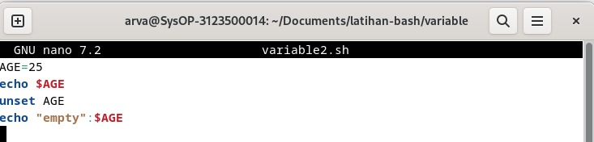
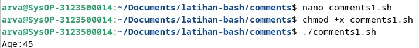
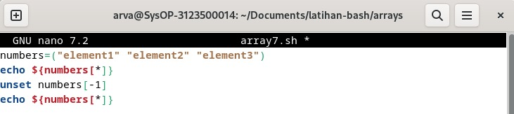
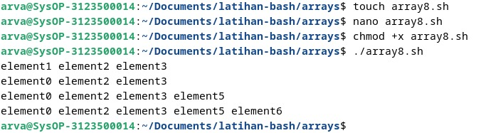

<div align="center">
  <h1 style="text-align: center;font-weight: bold">Praktikum 8<br>Praktek Sistem Operasi</h1>
  <h4 style="text-align: center;">Dosen Pengampu : Dr. Ferry Astika Saputra, S.T., M.Sc.</h4>
</div>
<br />
<div align="center">
  
  <h3 style="text-align: center;">Disusun Oleh : </h3>
  <p style="text-align: center;">
    <strong>Fauzan Abderrasheed (3123500020) </strong><br>
    <strong>Muhammad Rafi Dhiyaulhaq (3123500004) </strong><br>
    <strong>Arva Zaki Fanadzan (3123500014)</strong>
  </p>
<h3 style="text-align: center;line-height: 1.5">Politeknik Elektronika Negeri Surabaya<br>Departemen Teknik Informatika Dan Komputer<br>Program Studi Teknik Informatika<br>2023/2024</h3>
  <hr><hr>
</div>

## Bash Programming 

### Apa itu bash?

Bash, kependekan dari Bourne Again Shell, adalah open source command line interpreter dan scripting language. Ini menafsirkan perintah yang dimasukkan pengguna, baik secara interaktif atau dari file skrip.

Ini berfungsi sebagai interface untuk memanggil perintah, memungkinkan system function calls.

Ada 2 tipe dari mode bash

- **Interactive Mode**
    Juga disebut sebagai command intepreter, memungkinkan eksekusi perintah di terminal. Ini mengeksekusi perintah secara berurutan jika ada beberapa perintah.

- **Non-interactive Mode**
    Ini merujuk pada scrpts, memungkinkan Anda menulis Bash syntax yang berisi rangkaian beberapa perintah untuk eksekusi skrip.

### Apa Perbedaan dari Bash dan Shell

Shell, an alias for Bourne Shell, adalah command-line interpreter untuk OS Unix dan Linux. Bash, alias Bourne Again Shell, adalah versi yang disempurnakan.

### Untuk apa skrip bash digunakan?

Skrip Bash memiliki banyak kasus penggunaan, termasuk:
- Menulis skrip untuk mengotomatiskan tugas pemrograman
- Menyinkronkan tugas untuk menyalin file
- Menjalankan tugas cron untuk penjadwalan

### Bagaimana cara menulis kode di bash?

Untuk menulis kode dalam skrip Bash, ikuti langkah-langkah berikut:
- Di terminal, buat file menggunakan `vi test.sh`.
- Tambahkan `#!/bin/bash` di bagian atas file.
- Tambahkan beberapa cuplikan kode shell.
- Simpan file shell dengan `.sh` ekstensi.
- Jalankan skrip shell menggunakan `./test.sh` perintah di terminal.

### Apakah bash termasuk bahasa pengkodean?

Bash menjalankan perintah dari terminal atau file. Ini adalah bahasa pemrograman yang beroperasi pada sistem operasi kernel Unix/Linux, berisi semua fitur untuk menulis kode lengkap.

Bash adalah tipe shell khusus yang menerima masukan dari perintah, menjalankan kode, dan memproses masukan, serta mengembalikan hasilnya.

### Jenis Shell

Ada berbagai jenis shell di OS Unix.

<table>
<thead>
<tr>
  <th style="background-color: blue; color: white">Tipe Cangkang</th>
  <th style="background-color: blue; color: white">Alias</th>
  <th style="background-color: blue; color: white">Garis Pertama</th>
<tr>
</thead>
<tbody>
  <tr>
  <td>SH</td>
  <td>Bourne Shell</td>
  <td>#!/bin/sh</td>
  </tr>
   <tr>
  <td>bash</td>
  <td>Bourne Again Shell</td>
  <td>#!/bin/bash</td>
  </tr>
   <tr>
  <td>cshell</td>
  <td>C shel</td>
  <td>#!/bin/csh</td>
  </tr>
</tbody>
</table>

| tcsh | TENEX C shell | #!/bin/tcsh | | | | ksh | Korn shell | #!/bin/ksh |

### Perbedaan dari Command Line dan Script di bash

Mari kita lihat perbedaan antara baris perintah dan skrip

Opsi baris perintah

- Baris perintah memiliki prompt yang menerima masukan dari pengguna
- Perintah tidak disimpan ke file.
- Ini hanya mendukung satu perintah pada satu waktu.

File skrip

- Mendukung banyak perintah dalam satu file
- Prompt masih dapat ditulis dalam file skrip
- Hanya satu baris dalam sebuah file yang dijalankan secara berurutan

## Bash - Variables

**Deklarasi Variable**: Untuk membuat variable, maka harus memberikan nilai padanya

``` 
variableName=VariableValue
```

Keterangan: 

- variableName: dapat berisi kombinasi huruf apa saja, angka, dan garis bawah
- variableValue: adalah nilai yang disimpan dalam variabel, dan dapat berupa angka, string atau boolean. Simbol `=` digunakan untuk memberikan nilai pada suatu variabel.

Misalnya

```
AGE=25
```

### Cara mengakses variabel di bash


Pertama, deklarasikan variabel *AGE* dan beri nilai 25. Kemudian, gunakan `echo` untuk menampilkan outputnya. Simbol dolar `$` sebelum nama variabel sangat penting untuk mengakses nilainya.


### Bash Shell readonly variables


Setelah variabel diberi nilai, kita dapat mengubahnya menjadi nilai baru menggunakan operator penugasan =.


### Bash Unset Variable

Keyword `unset` membantu menghapus nilai dari variabel yang ditentukan. Variabel tetap dapat diakses tetapi akan mencetak nilai kosong.



Output:


### Variables Scope

Setiap variabel yang dideklarasikan harus memiliki cakupan, yang menentukan di mana variabel tersebut dapat digunakan dalam program.

Misalnya, jika suatu variabel dideklarasikan di dalam suatu fungsi, maka variabel tersebut hanya tersedia di dalam fungsi tersebut dan tidak dapat diakses di luar fungsi tersebut.

Dalam Bash, cakupan variabel dapat didefinisikan dengan dua cara:

- Variabel global: Variabel yang dideklarasikan di luar fungsi atau blok kode khusus dan dapat diakses dari seluruh bagian skrip.
- Variabel lokal: Variabel yang dideklarasikan di dalam fungsi atau blok kode khusus dan hanya dapat diakses di dalam fungsi atau blok tersebut.

Terkadang kita ingin membaca konten file menggunakan bash programming. 
Ada berbagai macam cara yang dapat kita lakukan

### Bagaimana cara membaca file demi baris di bash Shell?
- menggunakan perulangan while


Output


Output diatas merupakan isi dari file `loop-file.txt` 

## Bash - Comments

Posting ini menjelaskan cara menulis komentar dalam skrip bash shell, disertai dengan contoh.

Komentar dalam skrip bash shell adalah pernyataan kode yang berisi teks yang bisa dibaca oleh pengguna, namun dilewati oleh shell saat eksekusi. Setiap bahasa pemrograman memiliki fitur komentar, yang memberikan deskripsi pada baris kode atau pernyataan.

Komentar satu baris dalam kode membantu pengembang dalam mengedit dan memahami kode dengan lebih baik.

Bahasa skrip bash memungkinkan penggunaan dua jenis komentar:

- **Komentar satu baris**
- **Komentar multi-baris**

Komentar bermanfaat bagi manusia, karena kode ditulis untuk scripting.

### Komentar satu baris di bash shell 

Komentar satu baris dalam skrip shell dilambangkan dengan simbol `#` di awal setiap baris.

Komentar ini mengandung string yang memberikan informasi tentang baris kode terkait dalam skrip shell.

Penting untuk menempatkan komentar satu baris pada baris terpisah untuk kejelasan.

Untuk menulis komentar satu baris, gunakan simbol `#` di awal komentar. Komentar satu baris selalu dimulai dengan simbol `#`.

**Syntax:**

```
# Single-line comments
```

Spasi kosong setelah `#` simbol tidak diperlukan. Berikut ini adalah contoh komentar satu baris dalam skrip shell.


Output



### Komentar multi-baris dalam skrip shell


Output:


### Kesimpulan

Singkatnya, kita telah mempelajari cara menambahkan komentar satu baris dan multi-baris dalam pemrograman skrip shell.

## Bash - Arrays

Array dalam shell adalah variabel yang memungkinkan Anda menyimpan lebih dari satu nilai atau data dalam satu variabel. Misalnya, jika Anda memiliki daftar bilangan bulat dari 1 hingga 100, Anda dapat menggunakan array untuk menyimpannya dalam skrip shell, yang akan menghindari kebutuhan untuk mendeklarasikan setiap nilai secara terpisah dengan pernyataan seperti `let number1=1`, dan seterusnya. Dengan menggunakan array, Anda dapat merujuk ke satu variabel dan menyimpan semua nilai tersebut di dalamnya.

### Bagaimana cara mendeklarasikan dan membuat array?

Ada dua jenis array yang dapat kita buat:

- Array yang diindeks: Elemen array disimpan dengan indeks mulai dari nol.
- Array terkait: Array disimpan dengan pasangan nilai kunci.

**Deklarasi sebuah array**

Untuk membuat array, kita perlu mendeklarasikan array.
```
declares -a array; # indexed array
declare -A array; # associative array
```
Sebuah array dideklarasikan dengan kata kunci declaredengan opsi `-a` atau `A`

**Menetapkan nilai tanpa mendeklarasikan Array**

```
arrayvariable[index]=value
```
Artinya, `arrayvariable[indeks]` array dideklarasikan dan diberi nilai.

Array yang diindeks dimulai dari nol dengan panjang array - 1. Indeks 0 mengembalikan elemen pertama, sedangkan indeks -1 mengembalikan elemen terakhir.

Array bisa berisi angka, string, atau campurannya. Mari kita buat contoh array.

### Akses nilai Array

Array berisi indeks untuk mendapatkan elemen. Elemen array dapat diakses menggunakan sintaks di bawah ini.

```
${array_name[index]}
```

### Deklarasi Array angka dan Loop

Array dapat berisi angka Contoh ini berisi array angka dan loop for untuk dicetak


Output:


### Deklarasi Array string dan Loop

Array dapat berisi angka Contoh ini berisi array angka dan loop for untuk dicetak


Output:


### Akses elemen pertama array

Dalam array, indeks elemen pertama adalah nol, sehingga `array[0]` mengembalikan elemen pertama.


Output:


### Dapatkan element terakhir dalam sebuah array

Dalam skrip bash, Anda dapat menggunakan indeks -1 untuk mendapatkan elemen array terakhir.


Output:


### Iterate atau Loop element array

For loop digunakan untuk mengulangi elemen.

Berikut adalah contoh loop array untuk mencetak semua elemen


Output:


### Cetak semua elemen array

Gunakan [@] atau [*] untuk mencetak semua elemen array.


Output:


### Hapus elemen dari array

Anda dapat menghapus elemen dari array menggunakan `unset` indeks tertentu.



Output:


### Menambahkan elemen ke array

Anda dapat menambahkan elemen di posisi indeks mana pun menggunakan sintaksis di bawah ini.

```
array[index]=value
```


Output:



### Array cheat sheet

<table>
<thead>
<tr>
  <th style="background-color: blue; color: white">Example</th>
  <th style="background-color: blue; color: white">Description</th>
<tr>
</thead>
<tbody>
    <tr>
        <td>Sdeclare -a array	</td>
        <td>Declare an Indexed array</td>
    </tr>
    <tr>
        <td>declare -A array	</td>
        <td>Declare an Associative array</td>
    </tr>
    <tr>
        <td>declare -a array=()	</td>
        <td>Declare an indexed array with empty array</td>
    </tr>
    <tr>
        <td>array=()</td>
        <td>create an empty array with declaring is valid</td>
    </tr>
    <tr>
        <td>array=(1 6 3)</td>
        <td>Initialize array with numbers</td>
    </tr>
    <tr>
        <td>array=(one two three)</td>
        <td>Initialize the array with string</td>
    </tr>
    <tr>
        <td>array=(one two 1)</td>
        <td>Initialize the array with mixed data</td>
    </tr>
    <tr>
        <td>${array[0]}</td>
        <td>Get first element</td>
    </tr>
    <tr>
        <td>${array[1]}</td>
        <td>Get second element</td>
    </tr>
    <tr>
        <td>${array[-1]}</td>
        <td>Get last element</td>
    </tr>
    <tr>
        <td>${array[@]}</td>
        <td>Get All element</td>
    </tr>
    <tr>
        <td>${array[*]}</td>
        <td>Get All element</td>
    </tr>
    <tr>
        <td>${!array[!]}</td>
        <td>Get All indexes</td>
    </tr>
    <tr>
        <td>${#array[!]}</td>
        <td>Array length</td>
    </tr>
    <tr>
        <td>array[0]=12</td>
        <td>Add element to array at first position.i.e index=0</td>
    </tr>
    <tr>
        <td>array[-1]=22</td>
        <td>Add element to array at last position.</td>
    </tr>
    <tr>
        <td>array+=(11)</td>
        <td>Append value to an array</td>
    </tr>
    <tr>
        <td>${array[@]:k:i}</td>
        <td>Get index=1 element starting from index=k</td>
    </tr>
</tbody>
</table>

## Bash - Expansion

Tutorial ini menjelaskan cara menulis skrip batch dalam shell script dan menjalankannya.

Perintah dimasukkan ke sistem operasi untuk membuat panggilan sistem dan melakukan tindakan. Perintah masukan pengguna di terminal digunakan untuk melakukan operasi seperti `ls`, `cd`, `mkdir`, dan sebagainya.

Salah satu cara lain adalah dengan menempatkan beberapa perintah dalam satu file, di mana bahasa bash akan membaca dan menjalankannya.

Berikut adalah cara menulis skrip shell di bash:

- Pilih editor atau editor teks.
- Buat file dengan ekstensi `.sh` atau `.bash`.
- Tulis perintah dalam file.
- Simpan file sebagai `hello.sh`.


Output:


## Bash - Conditional Expression

Ekspresi kondisional dievaluasi saat skrip dieksekusi, dan berdasarkan hasilnya, ia mengeksekusi blok perintah tertentu.

Berikut beberapa jenis ekspresi kondisional di Bash:

- Operator perbandingan string
- Operator perbandingan numerik
- Operator file
- Operator logis

Conditional expressions berisi opsi dan jalur file yang selalu mengembalikan nilai benar atau salah.

Berikut adalah beberapa opsi yang disediakan:

<table>
<thead>
<tr>
  <th style="background-color: blue; color: white">Example</th>
  <th style="background-color: blue; color: white">Description</th>
<tr>
</thead>
<tbody>
    <tr>
        <td>-e file</td>
        <td>Returns true if given file exists, file can be normal file or directory</td>
    </tr>
    <tr>
        <td>-f file</td>
        <td>Returns true if given file exists and a file(not directory)<td>
    </tr>
    <tr>
        <td>-d file</td>
        <td>Returns true if file is an directory</td>
    </tr>
    <tr>
        <td>-r file</td>
        <td>Returns true if file exists and has readable permission</td>
    </tr>
    <tr>
        <td>-w file</td>
        <td>Returns true if given file exists, file can be normal file or directory</td>
    </tr>
    <tr>
        <td>-x file</td>
        <td>Returns true if file exists and has writable permission</td>
    </tr>
    <tr>
        <td>-s file</td>
        <td>Returns true if file exists and size is not empty</td>
    </tr>
    <tr>
        <td>-G file</td>
        <td>Returns true if file exists and isowned by a Group ID that matches</td>
    </tr>
    <tr>
        <td>-O file</td>
        <td>Returns true if file exists and owned by a user ID that matches</td>
    </tr>
    <tr>
        <td>-N file</td>
        <td>Returns true if file exists and modified by last read date</td>
    </tr>
    <tr>
        <td>-L file</td>
        <td>Returns true if file exists and and is an symbolic Link</td>
    </tr>
    <tr>
        <td>file1 -ot file2</td>
        <td>Returns true if file1 is older than file2 or file2 exists, file1 does not exist</td>
    </tr>
    <tr>
        <td>file1 -ne file2</td>
        <td>Returns true if file1 is newer than file2,file1 exists, file2 does not exists</td>
    </tr>
    <tr>
        <td>file1 -ef file2</td>
        <td>Returns true if file1 and file2 pointed to same device and inode</td>
    </tr>
</tbody>
</table>

## Bash - Case Statements

Pernyataan case mirip dengan switch case dalam bahasa pemrograman lain.

Ini digunakan untuk membandingkan masukan yang diberikan dengan beberapa pola, dan menjalankan perintah di dalam pola yang cocok.

Syntax:

```
case expression in

pattern1)
  ## Commands
  ;;
pattern1)
  ## Commands
  ;;
*)
  ## Default case to execute if none of the pattern is matched
  ;;
```

- Expression adalah variabel atau ekspresi yang valid untuk dievaluasi.
- Ini berisi pola yang didefinisikan di dalam case yang dievaluasi dengan membandingkan expression, mencocokkan case yang ditemukan, dan mengeksekusi perintah di dalamnya.
- Case default (`*`) dijalankan jika tidak ada pola yang cocok.
- Setiap blok pola diakhiri dengan `;;`.
`case` adalah kata awal dan `esac` merupakan kata yang mengakhiri pernyataan case.

Contohnya sebagai berikut:


Output:


## Bash - Special Characters

Spesial Characters dalam bahasa Bash dievaluasi dengan makna tertentu dalam pengolahan sebuah perintah. Karakter-karakter ini memiliki instruksi khusus yang memberikan makna yang berbeda tergantung pada konteksnya.

Tanda kutip tunggal ('), misalnya, digunakan untuk mendefinisikan sebuah string tanpa interpretasi khusus. Ini berarti semua variabel dan ekspansi tidak diproses dan string yang sama akan dicetak secara harfiah.

Sebagai contoh, dalam perintah `echo` yang pertama, variabel "nama" akan diperluas dan diinterpretasikan sebagai string sebelum dicetak. Namun, dalam perintah `echo` yang kedua, ketika tanda kutip tunggal digunakan, variabel "nama" tidak akan diperluas dan akan dicetak sebagai string literal.

Jika tanda kutip tunggal mengandung tanda kutip tunggal bertingkat, Anda perlu menghindarinya dengan menggunakan karakter ``` backtick ```.


Output : 


Tanda kutip ganda (") digunakan untuk mendefinisikan string literal dengan makna khusus. Ketika string mengandung variabel dan ekspansi sintaks, tanda kutip ganda akan menginterpretasikan dan memperluasnya, dengan nilai yang dievaluasi saat runtime.

Jika Anda ingin menghindari ekspansi variabel dalam string, Anda dapat menggunakan karakter escape (\) sebelum tanda dolar ($).

Sebagai contoh, dalam perintah `echo` yang pertama, variabel "nama" akan diekspansi dan diinterpretasikan sebagai string sebelum dicetak. Namun, dalam perintah `echo` yang kedua, karakter escape (\) digunakan sebelum tanda dolar ($), sehingga variabel "nama" dicetak sebagai string literal.


Output : 


Karakter Backslash (\) digunakan untuk melarikan karakter-karakter dalam string. Biasanya, ini digunakan dalam string yang diapit oleh tanda kutip ganda (""). 

Dalam contoh pertama, pada perintah `echo`,  akan menampilkan ID proses. Namun, dalam contoh kedua, perintah `echo` berisi \$, yang menyebabkan $$ ditampilkan sebagai string literal dengan karakter escape.


Output : 


## Bash Shell Conditional Statements

Bash Script menyediakan ekspresi kondisional untuk menjalankan kode yang berbeda berdasarkan kondisi yang ditentukan. Pernyataan if digunakan untuk menjalankan blok kode jika suatu kondisi benar, dengan sintaks if then fi. Pernyataan else digunakan untuk menjalankan kode jika kondisi salah, mengikuti sintaks if then else fi. Pernyataan if..elif..else berguna saat Anda perlu menjalankan kode jika tidak ada dari kondisi sebelumnya yang benar. Sintaksnya adalah sebagai berikut: 

- If-Else Conditional Statements


Output : 


- If..Elif..Else Statements


Output : 


## Bash - Loops

Loop digunakan untuk menjalankan blok kode untuk sejumlah kali tertentu. Misalnya, saat Anda ingin menjalankan perintah secara berulang atau mencetak array. Loop for digunakan dalam Bash. Ada beberapa jenis loop yang tersedia dalam Bash:
- Loop for
- Loop for indeks
- Loop while
- Loop until

##### for loop

Loop for digunakan untuk menjalankan kode beberapa kali berdasarkan kondisi yang ditentukan.


Output : 


##### for index loop

Loop for indeks mirip dengan loop for dalam bahasa C. Ini menjalankan kode beberapa kali berdasarkan kondisi yang benar. Dimulai dengan nilai awal dan iterasi berisi nilai yang akan ditambahkan dengan 1.


Output : 


##### while loop in bash

Loop while dalam Bash memungkinkan untuk menjalankan kode secara berulang selama kondisi tertentu benar. Jika kondisinya menjadi salah, loop keluar.


Output : 


##### Until loop in bash

Kata kunci until dalam Bash digunakan untuk menjalankan kode secara berulang hingga suatu kondisi tertentu menjadi benar, pada saat itu loop keluar.


Output : 


## Bash - Append String

contoh pemrograman untuk menggabungkan variabel string menggunakan penambahan sederhana dan operator aritmatika singkat. Ekspresi aritmatika digunakan untuk melakukan operasi matematika. "Ekspresi" adalah istilah yang digunakan dalam matematika untuk menunjukkan suatu operasi. Ini berisi operand dan operator untuk melakukan operasi matematika. Misalnya, a < b adalah suatu ekspresi. Ini dapat berisi operator biner atau uner.

Operator perbandingan digunakan untuk memeriksa nilai satu dengan yang lain dengan membandingkan nilai. Operator-operator tersebut adalah (<, <=, >, >=, ==, !=).


Output : 


